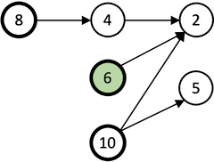

# Taxman
A program to find optimal solutions to the taxman game.

See the [project wiki](https://github.com/bvchess/taxman/wiki) for more information about the game and the
algorithm implemented by this program.

## Usage
`bin/taxman [options] <board size or range>`  

Where `board size or range` is an integer or range of integers.  Run the taxman command with no options in order to
learn more.  Here are some examples:

This command will show the moves made and the tax paid for optimal games from N=1 to
N=10:  
    `bin/taxman -s 1-10`  

This command will show debugging output as it searches for an optimal solution for N=450:  
    `bin/taxman -d 3 450`

## Implementation
The program includes pre-computed solutions to games from 1 to 701 so that it can make use of the solution to N-1
without having to compute it on every run.  These pre-computed solutions are available in JSON format
[here](src/main/resources/optimal.json).

I use the Java [BitSet](https://docs.oracle.com/en/java/javase/11/docs/api/java.base/java/util/BitSet.html) class for
fast operations on sets of small integers.  I use
Java [Streams](https://docs.oracle.com/en/java/javase/11/docs/api/java.base/java/util/stream/Stream.html)
and [ForkJoinPool](https://docs.oracle.com/en/java/javase/11/docs/api/java.base/java/util/concurrent/ForkJoinPool.html)
to take advantage of multi-core CPUs.

## References and Links
- The On-Line Encyclopedia of Integer Sequences documents the Taxman Sequence (the optimal player score)
as [A019312](https://oeis.org/A019312).
- My son built an interactive version of Taxman for N = 16.  You can play it online here: <http://xvade.com/taxman>.
Other online implementations are <http://davidbau.com/archives/2008/12/07/taxman_game.html> and
<https://www.cryptool.org/en/cto/taxman>.
  

## Acknowledgements
Thanks to EJ Technologies for the use of their excellent
[Java profiler](https://www.ej-technologies.com/products/jprofiler/overview.html).
