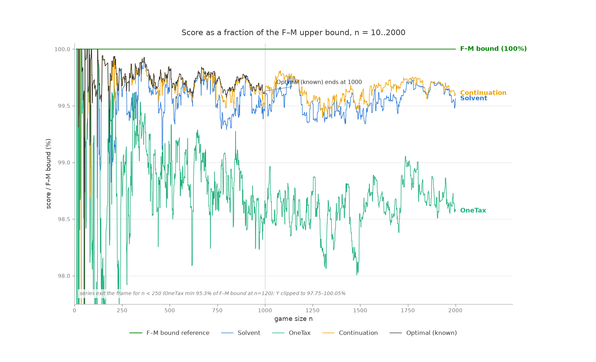

# Taxman Mini: the upper half of a Taxman game in polynomial time

This is a small, clean implementation built to test a theory about the
[Taxman game](https://github.com/bvchess/taxman/wiki/The-Game):

> There is a polynomial-time algorithm for obtaining all of the numbers
> greater than N/2 in the optimal answer, along with the optimal sequence
> for these numbers.

## Result

**The theory holds for every game from N=1 to N=1000.**

Checked against the known optimal solutions in
[`optimal.json`](../src/main/resources/optimal.json) - which were
themselves produced by the frame-based solver, so see
"What is independently certified" below for how much of this is
verified without shared assumptions (everything through n=63,
exhaustively through n=62):

```
games checked:        1000
set matches:          1000/1000   (selections > N/2 exactly match the optimal solution)
playable sequences:   1000/1000   (every produced sequence is a legal game)
identical order:      12/1000     (informational; optimal orderings are not unique)
```

## How it works

Every number greater than N/2 is a source node in the maximal factor graph
(no number in the game is a multiple of it), and all of its
[maximal factors](https://github.com/bvchess/taxman/wiki/Definitions#maximal-factor)
are at most N/2.  So

```
C = { c : N/2 < c <= N }
F = union of the maximal factors of the members of C
```

is a bipartite game in the style of
[Taxman Mini](https://github.com/bvchess/taxman/wiki/Taxman-Mini), and the two
procedures from that wiki page apply directly:

* `solve_mini(C, F)` repeatedly either takes a selection with only one
  remaining factor (play it now) or retires a factor needed by only one
  selection (play that selection last).  If neither rule applies, the
  remaining selections form a core in which tax demand exceeds factor
  supply, so not all of C can be selected.
* `optimize_mini(C, F)` considers selections from largest to smallest and
  keeps each one that leaves the accepted set solvable.  It is a
  generalization of the "take the highest prime" strategy.

### Ordering for a real game

One wrinkle: `solve_mini`'s recursion only reasons about maximal factors,
but in a real taxman game a selection sweeps **all** of its remaining
divisors from the pot.  For example, at N=21 the number 16 has the single
maximal factor 8, so `solve_mini` is free to emit it first — but played
first, 16 would also sweep 1, 2, and 4, starving 19, 14, and 12.

`solve_mini` does, however, produce a perfect matching: each selection is
assigned the factor it pays.  A sequence is playable in a real game exactly
when it respects the precedence *"a before b whenever a's assigned factor
divides b"*: then a consumes its factor before b can sweep it, and b cannot
rob a later selection of its factor.  A cycle in that precedence would
require two selections to share an assigned factor, which a matching
forbids, so a topological order always exists (`order_for_real_game`).
This plays the same role as solving the frames front-to-back in the wiki's
[N=21 walkthrough](https://github.com/bvchess/taxman/wiki/Walkthrough-for-N=21).

### Complexity

For a game N with |C| ≈ N/2 selections and E = Σ ω(c) selection–factor
edges: one `solve_mini` pass is O(|C| + |F| + E), `optimize_mini` runs it
once per candidate for O(N·E) = O(N² log log N), and the final ordering is
O(|C|²).  Comfortably polynomial; the full N=1..1000 verification runs in
under a minute of pure Python.

### Why the upper-half answer can be trusted

Three provable facts pin the upper half down.  (1) A number above N/2
has no multiples in the game, so it can never be taken as tax: it is a
pure prize, either claimed by the player or inherited by the taxman at
the end.  (2) Claiming a prize requires paying tax, and every divisor
of a prize lies at or below N/2, so each claim spends one single-use
lower-half coupon - distinct prizes need distinct coupons.  Sets of
prizes that can be assigned distinct coupons form a transversal
matroid, where greedy-by-value is provably optimal: **no legal game's
upper half can outscore the greedy coupon-assignable prize set.**
(3) Coupons must also survive until spent (a claim sweeps every
remaining divisor of the claimed number), which is the peeling check.

Why does greedy-largest-first survive here when it fails for the game
at large?  What makes Taxman hard is the one-for-two trade: skipping a
larger number so that two smaller ones, summing to more, become
claimable.  Above N/2 that trade cannot exist: every claim spends
exactly one coupon, so skipping a prize frees exactly one coupon,
which funds at most one other prize - a one-for-one market, where you
always keep the bigger prize.  At the matching level this is provable
(if one prize individually blocks each of two others, Hall's condition
forces all three onto the same coupon, so the two block each other
too - the matroid exchange property in plain clothes).  The trades
that require backtracking live below N/2, where a number is dual-use -
prize or coupon - and skipping one decision cascades value through
chains of reassignments.  That is the promotions/bin-packing step, and
it is why solving the one-for-one part exactly in O(n^2) collapses the
search to the ~13% of selections that are contested.

Measured against that proven matroid ceiling, the playable optimum
sits a whisker below: the pure-matching bound overshoots in 911/999
games, but only by ~101 points on average (257 points at N=1000, or
0.09% of the upper sum).  N=39 is the minimal specimen: matching
allows {22, ...} worth 486, but no claiming order delivers it, and the
true optimum takes 21 for 485 - exactly this project's set.  The
ordering constraint sits outside the one-for-one argument above, so
greedy is not formally immune there - but brute force shows unique
optimal upper sets through n=62, and no optimal game through n=1000
ever skips a greedily-feasible prize above N/2.

### What is independently certified, and what is not

There is a circularity risk in "the known optima agree with this
algorithm 1000/1000": optimal.json was produced by the frame/mini-game
solver, and this project's algorithm is built on the same structural
theory.  If the shared decomposition assumption were wrong, both could
miss the same better solutions.  `independent.py` therefore certifies
what it can using only arguments with no shared assumptions:

* **Replay** - every recorded solution is a legal game with a matching
  score, so every entry of optimal.json is a sound lower bound.
* **Brute force** - an exact solver over raw pot states (no frames, no
  matchings, no maximal factors) reproduces every optimal score for
  **n = 1..62** and shows this project's upper-half set is the
  **unique** optimal upper set in all 62 games; the certificate chain
  then adds n=63.  The wall is n=63 at ~150s/game using bitmask states
  (bitpot.py) under PyPy - 12.7x faster than the original pure-Python
  sets, which stalled at n=54.
* **Matching bound** - the maximum-weight-matching upper bound,
  recomputed here from scratch, equals the recorded score in 27 games;
  all of them lie below the brute-force frontier, so it adds nothing
  above n=54 (its tightness dies out as N grows).
* **Certificate chain** - opt(n) <= n + opt(n-1) is proved with no
  structural theory; a recorded solution achieving n + score(n-1) is
  certified given game n-1.  332 games satisfy the identity, but they
  are scattered in runs of at most 4, and none sits directly on the
  frontier, so the chain currently certifies nothing further.

Bottom line: games 1..63 are certified unconditionally, including the
uniqueness of the upper-half set through 62; for 64..1000, optimal.json is the
best known result and the 1000/1000 agreement between it and this
algorithm is strong consistency between two implementations of one
theory - not an independent proof of either.  The matroid ceiling and
the 0.09% sliver are pure mathematics and stand regardless.  The one
unproven step remains: that a full-game optimum never sacrifices upper
value for lower gain; every prize outweighs any single coupon
(prize > N/2 >= coupon), and no counterexample exists anywhere in the
certified range.

## How much of the game is in the lower half?

Since the upper half is solvable in polynomial time, the hard part of
Taxman is choosing the selections at or below N/2.  From the known
optimal solutions (`python3 halves.py`):

| N range | lower-half selections | share of moves | share of points | max share |
|---|---|---|---|---|
| 2-100 | 1.9 | 8.6% | 4.28% | 8.11% |
| 101-300 | 10.0 | 11.6% | 6.68% | 8.90% |
| 301-600 | 24.8 | 12.7% | 7.35% | 8.08% |
| 601-1000 | 45.2 | 13.0% | 7.53% | 7.94% |

At N=1000, 58 of the 435 optimal selections are below N/2, worth 7.66%
of the score.  The share never exceeds 8.90% (N=114), so playing the
upper half perfectly already guarantees more than 91% of the optimal
score — the entire computationally hard part of the game is fighting
over the last ~8%.

## Approximating the full game in O(n²)

`approx.py` extends the upper-half machinery to the whole game.  It is
built on a characterization of playability that generalizes the
ordering argument above:

> A set of selections can all be played, in some order, **iff** there is
> a matching assigning each selection a distinct divisor still in the
> game, such that the precedence relation *"a before b whenever a's
> assigned divisor divides b, or a divides b"* is acyclic.  Any
> topological order of the precedence is a legal game.

The **greedy** strategy is then the full-game generalization of "take
the highest prime": consider n, n-1, ..., 2 and accept each number if
an augmenting path can add it to the matching (if no augmenting path
exists, no matching covers it — a permanent, well-founded rejection)
and a precedence-respecting assignment can be found.  This is O(n)
augmenting searches of O(n log n) each, plus one acyclicity check per
acceptance — about O(n² log n) worst case, a few hundred milliseconds
at n=1000 in pure Python.

Results for N=1..1000 against the known optima, alongside the pure
band-by-band cascade of upper-half mini games (**cascade**) and two
heuristics from [Robert Moniot's strategy comparison]
(https://www.dsm.fordham.edu/~moniot/taxman-strategies-comparison.html)
reimplemented here (**onetax**, **maxturn** — our implementations match
his published N≤128 table in 128/128 games for MaxTurn and 127/128 for
OneTax, where at N=128 ours scores 5289 vs his 5193):

| strategy | mean % of optimal | worst game | exactly optimal |
|---|---|---|---|
| greedy (this project) | 98.97% | 97.81% | 89/999 |
| onetax (Moniot) | 99.10% | 96.00% | 42/999 |
| cascade (this project) | 93.02% | 91.10% | 19/999 |
| maxturn (Carmony & Holliday) | 90.55% | 86.12% | 14/999 |

Selected games:

| n | optimal | greedy | onetax | cascade | maxturn |
|---|---|---|---|---|---|
| 21 | 144 | **144** | 144 | 135 | 135 |
| 100 | 3164 | **3161** | 3148 | 2976 | 2904 |
| 128 | 5301 | **5289** | 5289 | 4945 | 4816 |
| 500 | 78934 | 77631 | **78284** | 72849 | 71100 |
| 1000 | 315426 | 311260 | **312350** | 291258 | 286608 |

So an O(n²)-class algorithm gets within about 1% of optimal: greedy has
the best worst case (never below 97.8%) and finds the most exact optima
(89, including every game up to N=52); OneTax has a slightly better
mean for large N.  The cascade line quantifies what the verified
upper-half theory achieves entirely on its own, with no promotions —
about 93%, matching the lower-half share analysis above.

## Does OneTax get the upper half right?

No (`python3 upper_fidelity.py`).  Over N=2..1000 OneTax selects the
wrong set of numbers above N/2 in **83.7%** of games, and in none of
those does it still score optimal.  Its upper-half errors are always
omissions, never wrong picks: OneTax only selects a number once it is
down to a single divisor, and composite upper numbers whose divisor
counts never drain to one (e.g. 488, 506, 513, 522... for N around
970) simply never get picked.  The errors are self-compensating,
though: summed over all games OneTax gives up 1,143,256 points in the
upper half but wins 158,870 points *more* than optimal in the lower
half, because every skipped upper number leaves its would-be tax in
play to be farmed.

`one_tax_forced_upper` in `approx.py` tests the obvious repair: run
OneTax, but only allow a pick if the remaining optimal upper selections
are still solvable afterwards (a solve_mini feasibility check), and
when OneTax stalls, play the cheapest still-solvable upper selection.
Two designs matter here:

* Pinning each upper selection to a reserved factor (the maximal-factor
  matching) fails badly — 94.9% of optimal — because optimal play needs
  the upper half's tax demands to stay *flexible*.
* The dynamic-feasibility version wins: **99.264%** of all optimal
  points vs OneTax's 99.065% (better in 537 games, equal in 102, worse
  in 360).  For small games (N ≤ 300) plain OneTax still edges it out,
  and no strategy dominates game-by-game: forcing the upper half
  shifts tax pressure into the lower half, which sometimes costs more
  than the forced upper numbers are worth.

The count of upper numbers OneTax misses predicts the winner sharply
(`python3 portfolio.py`): when it misses 0-2, forcing nets negative;
from 3 up, forcing is nearly a free win.  That tension is resolved by
the fork oracle below.

## The fork oracle: pricing picks, then comparing continuations

`one_tax_oracle` in `approx.py` merges the two approaches.  The upper
machinery acts as an economist rather than a dictator: it tracks the
achievable set of upper selections (initially the provably optimal
upper half), any pick that keeps the set solvable is free, and a pick
that breaks it is charged the drop in achievable upper value
(re-derived by optimize_mini) - allowed only if the pick is worth more
than the loss, with the protected set shrinking accordingly.

Per-pick pricing alone turns out to converge to the hard veto: a
single pick is always worth less than the upper number it destroys,
but OneTax's advantage comes from *bundles* of unconstrained picks -
the same locality lesson as the 2-tax result, from the other side.  So
the oracle compares continuations instead of picks: wherever the
priced spine plays a different move than plain OneTax would, it
snapshots the position, and afterwards plays a plain OneTax tail out
of every snapshot.  The answer is the best of the spine and all tails,
which by construction is at least as good as both plain OneTax and the
forced-upper hybrid on **every single game** (asserted at runtime).

| strategy | share of all optimal points, N=1..1000 | exact optima |
|---|---|---|
| **fork oracle (this project)** | **99.414%** | 56/999 |
| forced-upper OneTax (this project) | 99.264% | 50/999 |
| onetax (Moniot) | 99.065% | 42/999 |
| greedy (this project) | 98.601% | 89/999 |
| cascade (this project) | 92.520% | 19/999 |
| maxturn (Carmony & Holliday) | 90.294% | 14/999 |

The oracle alone beats the old max(onetax, hybrid) portfolio (99.312%)
and makes both parents obsolete: neither is the sole best strategy in
a single game.  The four-way portfolio with greedy - which still wins
192 games outright, mostly via its 89 exact optima - reaches
**99.427%**, leaving about 0.57% of optimal on the table.

### Fixing greedy's false vetoes made it the champion

The transition diagnostic later proved greedy's acceptance test
incomplete: on a precedence cycle it only retried the candidate's own
coupons, falsely vetoing playable picks whose cycles route through
other selections' assignments.  try_select now falls back to a
complete tier (the solve_mini bipartite reduction, verified against
the full precedence) before rejecting.  The transformation:

| greedy | before fix | after fix |
|---|---|---|
| mean % of optimal | 98.97% | **99.86%** |
| worst game | 97.81% | **99.08%** |
| exactly optimal | 89/999 | **214/999** |
| share of all optimal points | 98.601% | **99.851%** |

Greedy is now the strongest single strategy by a wide margin
(the fork oracle held 99.414%), gaining 1.32M points across the range
with 891 games improved and 16 slightly regressed; cycle rejections
fell ~62%, and the four-strategy portfolio (99.854%) is now
essentially greedy alone.  Earlier autopsy and rejection
numbers for greedy in this README describe the pre-fix version.

### Greedy, final form

With a complete playability test, every compensating mechanism became
dead weight and was removed - the second-chance pass (measured: zero
rescues; provable: complete rejections are permanent since playable
sets are downward-closed), the forced-coupon cycle retries (subsumed
by the complete tier), and the end-of-game cycle repair (unreachable;
now a loud error).  Deleting them changed no score in any of the 1000
games; the sole rejection reason is "infeasible" - a theorem, every
time.  The algorithm of record, as a straight-line reference
implementation (`greedy_simple.py` - runnable, no optimizations,
verified against the fast greedy for exact set equality):

```python
class Infeasible(Exception):
    """Raised when solve_mini cannot pay every member from the factor pool."""


def proper_divisors(c):
    return [d for d in range(1, c) if c % d == 0]


def solve_mini(members, factors, factors_of):
    if not members:
        return [], {}

    for c in members:
        remaining = factors_of[c] & factors
        if len(remaining) == 1:
            (f,) = remaining
            seq, pay = solve_mini(members - {c}, factors - {f}, factors_of)
            pay[c] = f
            return [c] + seq, pay

    for f in factors:
        payers = [c for c in members if f in factors_of[c]]
        if len(payers) == 1:
            c = payers[0]
            seq, pay = solve_mini(members - {c}, factors - {f}, factors_of)
            pay[c] = f
            return seq + [c], pay

    raise Infeasible(f"cannot select every member of {members} using {factors}")


def playable(s_set):
    factors = set()
    for s in s_set:
        factors |= set(proper_divisors(s))
    factors -= s_set

    factors_of = {s: set(proper_divisors(s)) & factors for s in s_set}

    try:
        _, pay = solve_mini(s_set, factors, factors_of)
    except Infeasible:
        return None
    return pay


def ordered(s_set, pay):
    remaining = set(s_set)
    placed = []
    while remaining:
        for a in remaining:
            blocked = any(
                b != a
                and ((pay.get(b) is not None and a % pay[b] == 0) or a % b == 0)
                for b in remaining
            )
            if not blocked:
                placed.append(a)
                remaining.discard(a)
                break
        else:
            raise RuntimeError(
                f"schedulability conjecture violated: no valid ordering "
                f"exists for {remaining}"
            )
    return placed


def greedy(n):
    s = set()
    for c in range(n, 1, -1):
        if playable(s | {c}) is not None:
            s.add(c)
    pay = playable(s)
    return ordered(s, pay)
```

Three remarks:

1. **This is optimize_mini, promoted to the whole game.**  The loop is
   identical - descending order, keep what stays solvable - and the
   feasibility test is the same solve_mini, unchanged.  Only the
   meaning of "factor" generalizes: in the upper-half game a
   selection's factors are its maximal factors; here they are all of
   its divisors not themselves selected.  Restrict greedy(N) to the
   numbers above N/2 and it collapses back into optimize_mini.

2. **ordered needs one condition the mini game didn't.**  solve_mini
   already orders what it solves - the front/back placement in its two
   rules is exactly what keeps each selection's payment available when
   its turn comes.  In a true mini game nothing selected divides
   anything else selected, so that order suffices.  In the full game
   selections can divide each other, so ordered() rebuilds the order
   from pay() with one added rule: "s before t whenever s divides t" -
   the smaller pick is taken before the larger one sweeps it.

3. **What is proved and what is trusted.**  A solve_mini error makes
   rejection a theorem: no assignment of distinct factors exists, and
   adding more selections only makes it harder.  A solve_mini success
   is trusted to be orderable - the *schedulability conjecture*,
   unbeaten in every game ever run.  If it ever fails, ordered() finds
   no valid ordering and the program stops with an error rather than
   playing a bad game.

Implementation note: `greedy_simple.py` is the specification, not the
production code.  It re-solves the mini game from scratch for every
candidate; the fast implementation in `approx.py` keeps a running
assignment (Kuhn augmenting + an acyclicity check) and only falls back
to the full solve_mini reduction when the incremental update fails -
bit-identical results (exact set equality checked in the test suite
and across n=1..300), at a fraction of the cost.
Because acceptance is decided by a complete test, the output set is
canonical: a deterministic function of playability alone, independent
of coupon preferences or augmenting-path order.

## Why a 2-tax rule cannot be bolted onto OneTax

The tax census above suggested an attractive idea: optimal games make
2-tax moves in 946 of 999 games, carrying more net value (875K points)
than OneTax's entire gap to optimal, so teach OneTax to pay two taxes.
It does not work, for reasons worth recording (`one_tax(two_tax=True)`
keeps the provably-safe version of the rule; it never fires).

1. **There is no endgame slack.**  A "stranded harvest" - pick a number
   whose two remaining divisors are dead, since the taxman was getting
   all three anyway - can never trigger: in all 999 games OneTax
   terminates with every pot number at zero divisors.  OneTax pays
   exactly one divisor per pick, so nothing is ever wasted; the pot is
   always drained bone-dry.

2. **Losses are sniping, not sticking.**  Tracing the upper numbers
   OneTax misses (e.g. 494 at N=970): the number drops to its last
   divisor (38), and next turn OneTax hands that divisor to a larger
   claimant (646 = 17·38).  The number dies at count 0, not count 2.

3. **A local 2-tax rescue is either unnecessary or unaffordable.**
   Consider x at two divisors whose rivals are the current one-tax
   claimants c1 and c2.  If the rivals are smaller than x, x needs no
   rescue: when one divisor is consumed, x reaches one divisor and
   outranks them.  If the rivals are larger, the rescue price exceeds
   2x and can never be worth x.  Forcing the exchange whenever
   x > c1 + c2 loses 1.75M points over N=1..1000 (it fires exactly in
   the cases where x would have won anyway, paying double).

So the 875K points that optimal games route through 2-tax moves are
**coordination gains**: they are profitable only because optimal
simultaneously reassigns which taxes the surrounding numbers pay.  Any
strategy that wants them must reason about the assignment of divisors
to selections - the matching machinery - not about individual picks.

## Divergence autopsy: what exactly goes wrong (n=500-1000)

`diagnose.py` traces the fate of every optimal pick that OneTax and
greedy fail to make, for all 501 games in 500..1000 (full per-miss logs
in `divergence_onetax.json` / `divergence_greedy.json`).  The taxonomy
is strikingly clean:

|  | OneTax | greedy |
|---|---|---|
| net points lost | 874,945 | 1,363,455 |
| upper misses | 2,320 (1.03M pts) - **100% sniped** | 32 (14K pts) |
| lower misses | 5,649 (1.74M pts) - **100% spent as tax** | 8,894 (2.72M pts) - 100% spent as tax |
| killer is itself an optimal pick | 99.8% | 100% |
| missed 2-tax acquisitions | 82 (28K pts) | 113 (40K pts) |

Three conclusions.  (1) **Every failure is an assignment failure.**
The strategies spend lower numbers as tax for picks that ARE in the
optimal solution - optimal simply funds those picks with different
divisors.  Nothing is ever double-swept or wasted; the money is spent
on the right things through the wrong accounts.  (2) **The 2-tax /
sacrifice residue is marginal**: under 3% of either strategy's loss
comes from numbers optimal acquires with two taxes.  The one-for-two
trade, dramatic as it is, is not where the points are; one-for-one
re-routing (augmenting) addresses ~97% of the identified loss.
(3) **Greedy's specific disease is the ordering constraint**: its
rejection log shows precedence-cycle vetoes outnumber matching
failures 15:1 (16,369 cycle rejections vs 1,081 no-path).  Its Kuhn
matching is nearly perfect - only 32 upper misses in 501 games - but
its cycle handling only retries the candidate's own coupon choices,
never re-routing other selections to break the cycle.

### How deep do the re-routing chains go?

`chains.py` follows each missed number's funding chain backward through
the OneTax game (full results in `divergence_chains.json`).  The answer
is stark: **post-hoc re-routing recovers essentially nothing.**  Across
all 5,649 taxed misses in 500..1000, not one chain resolves at depths
1-8 by finding an idle alternative coupon; OneTax leaves nothing idle.
The chains terminate at role decisions instead: in 2,598 cases (897K
points, half the loss) the needed coupon **was itself picked by the
player**; 1,376 (380K) exit the optimal solution entirely; 1,661 (455K)
tangle in same-turn multi-sweeps from the rescue rule.  Moreover 80% of
taxed misses had zero divisors left when swept - already dead as picks,
the sweep a formality; the losing moment came much earlier, when their
last own-coupon was consumed.

Conclusion: the assignment failures cannot be fixed reactively.  They
must be prevented prospectively - by deciding coupon-vs-pick roles in
advance and protecting the reservations - which is exactly what the
upper-half machinery does above N/2 and what a rolling band ledger
would extend below it.  (Also documented here: OneTax is not strictly
one-tax - Moniot's rescue rule pays two taxes in ~23% of these kill
events, e.g. pick 368 sweeping 92 and 184 at n=500.)

## Transition anatomy: solving N by searching near N-1 (n=500-1000)

`transitions.py` measures, for every transition n-1 -> n, the kind and
depth of search needed to reach the optimal n solution from an adapted
n-1 solution (exact upper set + previous lower roles + insertion).
Full per-transition records in `transitions.json`.  Headlines:

* **76.2% of transitions need no search at all**: pure insertion lands
  exactly on the optimal solution (gap 0 in 382/501).
* **Locality is strong but not perfect** (corrected: the first
  measurement let paths run through the number 1, which divides
  everything and makes distance-2 vacuous).  With 1 excluded, 80.8%
  of the 834 changed lower numbers share a prime factor with the
  arriving n (true divisor-distance <= 2); the remaining 19.2% are
  coprime to n, at distance 3-4, and none are farther.  A search
  neighborhood keyed to n's prime factors covers four-fifths of the
  churn; the rest needs one more hop.
* **Geodesic depth**: 0 flips in 382 games, 1-3 flips in 51 more
  (single flips and small compounds), **blocked in 68 (13.6%)** - real
  landscape valleys where every improving move is an atomic bundle of
  4+ flips (e.g. n=507: add 198+182, drop 154+220, net +6, every
  smaller step strictly worse).  Blind steepest-ascent reaches optimal
  in 78.4% of transitions; when it stalls, the residual averages just
  82 points (~0.04% of score).
* Discovered en route: the greedy strategy's playability test is
  provably incomplete - forcing only the candidate's own coupons
  cannot break cycles running through other picks' assignments, so
  many of its 16K "cycle" rejections are false vetoes.  The two-tier
  evaluator here (greedy test backed by a complete solve_mini oracle)
  is the repair.

Implication for a continuation solver: insertion + a depth-3 flip
search over the distance-2 neighborhood of n reproduces the optimal
solution in ~87% of transitions and lands within ~0.04% otherwise;
closing the last 13.6% requires bundle moves (coupled add/remove sets)
or accepting temporary score descents.  Per-transition cost of the
full diagnostic protocol: ~0.5s.

## The continuation solver (v1)

`continuation.py` implements the search-near-N-1 system: exact upper
half, previous solution's lower roles, certificate check, then
single-flip ascent and bundle moves (SetEval, now shared in
`seteval.py`, provides incremental matching with the complete
solve_mini playability tier).  Every produced solution is replayed as
a legal game in-solver.

Seeded from optimal(499) and self-fed on 500..540: **25/41 games exact
(61%), mean gap 12.1 points (~0.015% of score)** - about ten times
closer to optimal than greedy on the same slice - with 500..520
solved 21/21.  The misses begin at n=525 and are exactly the
documented "blocked valley" class: crossing them needs atomic swaps of
3-4 simultaneous removals (n=525: remove {116,186,189,250}, add
{147,174,210,248}), beyond v1's two-removal bundles, and they fail the
same way even when seeded from the true optimal n-1 - genuine
landscape, not accumulated drift.  Cost: certified games <0.2s;
valley games 20-70s (the complete playability tier dominates).

The full self-fed run 500..1000 (seeded once from optimal(499),
3.7h) answers the drift question with data
(`continuation_results.json`):

| band | mean gap | exact |
|---|---|---|
| 500-599 | 17.9 | 56/100 |
| 600-699 | 21.6 | 50/100 |
| 700-799 | 91.7 | 14/100 |
| 800-899 | 66.4 | 9/100 |
| 900-999 | 86.4 | 1/100 |

Drift is real but bounded: missed valleys become standing deficits
that accumulate (exact matches nearly vanish by the 900s), yet the
mean gap stays ~0.03% of score and does not run away.  Point-weighted
over the whole range the chain holds **99.969% of optimal** - about
5x closer than greedy (99.854%) - and beats greedy game-by-game
400 to 52.  Certificates keep firing at 31% even self-fed.

**Cold start converges exactly.**  A chain started from nothing at
n=2 (no optimal.json seed anywhere, `continuation_cold_results.json`)
heals its own early mistakes completely: by n=500 it produces scores
identical to the optimal-seeded chain in 501/501 games, and holds
**99.970% of all optimal points over 2..1000** (476/999 exact) as a
fully self-contained solver.  A perfect seed is worth nothing by
mid-range - the certificate/insertion dynamics snap the chain back
onto an optimal path.

**The measured efficiency frontier (500..1000, one 2.8GHz core):**

| configuration | share of optimal | wall time |
|---|---|---|
| flips only (no bundles) | 99.81% | 2 min |
| greedy, per game | 99.85% | ~11 min |
| bundles capped at 100 + greedy re-anchor | **99.95%** | **26 min** |
| full bundle budget | 99.97% | 3.7 h |

The capped configuration captures ~90% of the chain's advantage over
greedy at ~12% of the full cost (mean 3.1s/game, max 12s) and is the
recommended default; the full budget is the publication-quality
setting.  Greedy re-anchoring fired in only 9/501 games - the chain
rarely needs its floor - but it is what caps drift by construction.
Also measured: with no bundle repair at all, chain drift compounds
(mean gap 132 -> 605 across bands); in a self-fed system, valley
repair is infrastructure, not luxury.

Open items: deeper bundles or temporary-descent moves for the ~13.6%
valley class (the entire residual), and an incremental SetEval to cut
valley-game cost.

## Beyond ground truth: best-known solutions for 1001-2000

There is no optimal.json past n=1000, so the extension to n=2000
changes what "how good is it?" can mean: every strategy is now
measured against the Franklín-Moniot upper bound (`fm_bound_2000.json`,
exact per-game values for 2..2000), and each game carries a
*certified* gap - the distance to the bound, which the true optimum
also lives inside.

The chain (`continuation_chain_2000.json`) was seeded once from
optimal(1000) and self-fed through 2000 in the recommended
configuration (bundles capped at 100, greedy re-anchor), 3.3h under
PyPy, every solution replayed as a legal game in-solver.  Results
over 1001..2000, as a share of the F-M bound:

| strategy | mean | worst game |
|---|---|---|
| continuation chain | **99.64%** | 99.40% (n=1302) |
| greedy | 99.56% | 99.34% |
| onetax | 98.61% | 98.01% |

For calibration: over 500..1000, where the truth is known, the
*optimal* score averages 99.71% of the bound (never below 99.57%),
and the chain plays within 0.03% of optimal.  The chain's 99.64%
band in 1001..2000 is therefore consistent with continued
near-optimal play; most of the certified gap is bound looseness, not
heuristic error.  (Decomposed at n=1000, where both are known: of the
1168-point gap between bound and optimum, 257 points are the bound
overpaying the upper half - it matches picks to single maximal
factors with no sweep or ordering constraints - and 911 points are
the same relaxation in the lower half.)

The chain's internal signals also stay healthy in unmapped territory:
certificates (score = n + score(n-1)) keep firing at 31.5%, mean
lower-half churn is 1.23 numbers per game, 76.8% of games resolve at
tier 0, and the greedy re-anchor floor was needed in only 22/1000
games.  Game-by-game the chain beats greedy 894 times and ties 106,
never losing (the re-anchor guarantees the floor); over the whole
range it collects 579,264 more points than greedy and 7.45M more
than OneTax, finishing within **0.352%** of the theoretical ceiling
in aggregate - `continuation_chain_2000.json` is, as of this run,
the best known set of solutions for these 1000 games.




The second chart is the readable one: dividing by the bound cancels
the number-theoretic jitter shared by every series (the bound line
itself becomes the flat 100% reference), and the strategies separate
into clean bands - the chain hugging the altitude the true optimum
occupied below 1000, greedy ~0.1 points lower, OneTax sagging a full
point below that.

## Performance

Per-game wall time in pure Python (best of 3, `python3 bench.py`), with
the empirical scaling exponent k in time ~ n^k:

| component | n=125 | n=250 | n=500 | n=1000 | ~n^k |
|---|---|---|---|---|---|
| onetax | 0.2 ms | 0.6 ms | 1.9 ms | 6.1 ms | 1.6 |
| maxturn | 0.3 ms | 1.2 ms | 4.4 ms | 19 ms | 1.9 |
| upper half (`solve_upper_half`) | 2.7 ms | 10 ms | 38 ms | 168 ms | 2.0 |
| cascade | 3.8 ms | 16 ms | 66 ms | 310 ms | 2.1 |
| hybrid (forced upper) | 5.8 ms | 24 ms | 91 ms | 430 ms | 2.1 |
| greedy | 3.8 ms | 62 ms | 377 ms | 1.2 s | 2.7 |
| oracle (fork) | 6.1 ms | 62 ms | 215 ms | ~2 s | ~3 |

OneTax is indeed nearly free.  Determining the optimal >N/2 moves is a
clean O(n²): optimize_mini runs one O(n) feasibility check per
candidate.  The oracle is the expensive one - profiling shows
essentially all of its time inside `price()`: every candidate pick
triggers a solve_mini feasibility check, and every break triggers an
optimize_mini re-derivation (tens of thousands of solve_mini calls per
game).  Pricing now bails out as soon as the accumulated loss reaches
the pick's value, which saves ~1.4x; the remaining cost is dominated
by the members that are *kept* during re-derivation, so the next real
speedup would be an incremental feasibility structure rather than
rebuilding the mini graph per check.

## Running it

No dependencies beyond Python 3.8+ (pytest for the test suite).

```
python3 verify.py                  # check the upper-half theory, N=1..1000
python3 verify.py --max-n 200 -v   # smaller range, per-game detail
python3 halves.py                  # lower-half share of the optimal score
python3 approx.py                  # full-game strategy comparison (~9 min)
python3 upper_fidelity.py          # OneTax upper-half errors + forced-upper hybrid (~7 min)
python3 -m pytest test_taxman_mini.py
```

## Files

| file | contents |
|---|---|
| `taxman_mini.py` | the core algorithm: `maximal_factors`, `solve_mini`, `optimize_mini`, `order_for_real_game`, `solve_upper_half` |
| `verify.py` | checks the upper-half theory against `optimal.json` for N=1..1000 |
| `halves.py` | how much of the optimal score comes from selections ≤ N/2 |
| `approx.py` | full-game approximation strategies and the Moniot comparison |
| `upper_fidelity.py` | OneTax's upper-half fidelity and the forced-upper hybrid |
| `independent.py` | theory-free certification of optimal.json (brute force, matching bound, certificate chain) |
| `bound.py` | the Franklín-Moniot upper bound (max-weight matching over maximal-factor edges) |
| `bench.py` | per-strategy timing, scaling exponents, and profiling |
| `diagnose.py` | divergence autopsy: per-miss fate logs for OneTax and greedy |
| `chains.py` | funding-chain depth analysis of the missed numbers |
| `transitions.py` | search kind/depth needed to solve n from the n-1 solution |
| `greedy_simple.py` | illustration-grade reference implementation of greedy (the README's algorithm of record, runnable) |
| `seteval.py` | incremental set evaluator: matching + complete playability tier |
| `continuation.py` | the continuation solver: solve n by searching near n-1 |
| `moniot_table.json` | Robert Moniot's published N≤128 results (for validation) |
| `approx_results.json` | per-game scores of every strategy for N=1..1000 |
| `greedy_results.json` | canonical greedy scores for N=1..1000 (regression baseline) |
| `fm_bound_2000.json` | exact Franklín-Moniot bound for every N=2..2000 |
| `continuation_chain_2000.json` | the chain's best-known solutions for N=1001..2000 |
| `greedy_2000.json`, `onetax_2000.json`, `maxturn_2000.json` | per-game scores extending those strategies to N=2000 |
| `pot_fraction.png`, `score_vs_bound.png` | the two summary charts (absolute pot share; share of the F-M bound) |
| `test_taxman_mini.py` | unit tests anchored to the wiki's examples |
