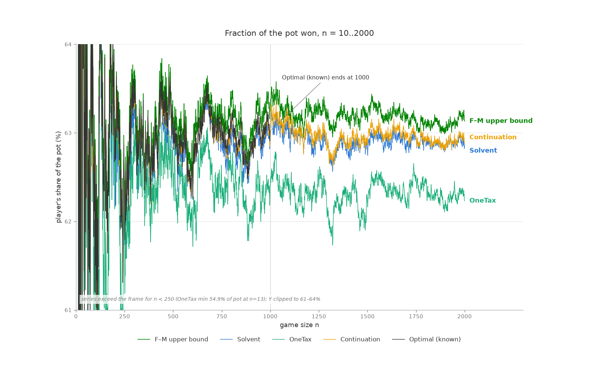
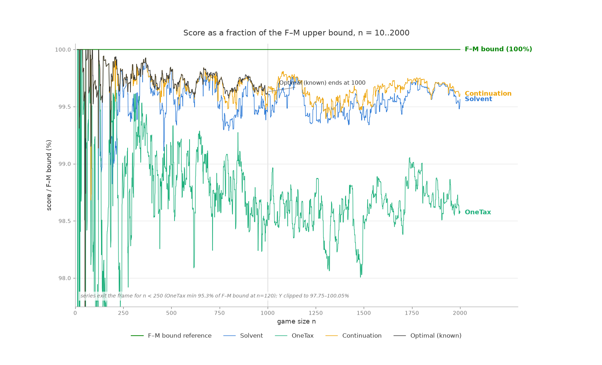

# Most of an optimal Taxman game in polynomial time

Taxman is played against a pot {1..n}: picking c keeps c and surrenders
every divisor of c still in the pot; every pick must surrender at least
one divisor; the taxman sweeps the leftovers.  Finding an optimal game
is a hard search problem — but it turns out most of an optimal game is
not a search problem at all.

Three results, in increasing order of ambition:

1. **The selections greater than n/2 of an optimal game — and a legal
   order for them — are computable in O(n²)** (the theory this project
   set out to test, from
   [the wiki](https://github.com/bvchess/taxman/wiki/Taxman-Mini)).
   Verified against known optimal solutions for every n = 1..1000.
2. **A near-quadratic — O(n² log n) — strategy for the whole game,
   solvent, holds 99.85% of all optimal points** over n = 1..1000,
   never dropping below 99.08% in any game, with no search and no
   lookahead.
3. **A self-fed continuation solver holds 99.97% of all optimal
   points**, starting from nothing at n=2, and extends to the best
   known solutions for n = 1001..2000 — provably within 0.35% of the
   theoretical ceiling in aggregate out there, where no ground truth
   exists.





The second chart divides every score by the Franklín–Moniot upper
bound, which cancels the number-theoretic jitter all strategies share:
the bound becomes the flat 100% line and the strategies separate into
clean bands, with the continuation chain holding, beyond n=1000, the
same altitude the true optimum occupies below it.

## The theory: the upper half is a matching problem

No number above n/2 divides another (2c > n), so the upper half of any
game is swept only through the lower half.  That turns upper-half
selection into a bipartite question.  Define the *maximal factors* of
c as the divisors f with c/f prime — the divisors reached by deleting
one prime from c.

> **Playability.**  A set S of selections can all be played, in some
> order, **iff** there is a matching assigning each member a distinct
> maximal factor not in S such that the precedence relation "a before
> b whenever a's assigned factor divides b, or a divides b" is
> acyclic.  Any topological order of the precedence is a legal game.

One direction is a construction (play the topological order; each
pick's reserved payment provably survives until its turn).  The other
is the Franklín–Moniot lifting argument turned inward: whatever
divisor d a pick actually surrenders lifts to a maximal factor f with
d | f | c; f must still be in the pot (anything that had removed f
would have removed d with it), and f cannot itself be a selection, or
the pick's sweep would destroy an unplayed number.  So every legal
game already pays each pick with a distinct outside maximal factor —
maximal factors are the only factor notion the whole project needs.
(Restricting solvent's payment pool from all divisors to maximal
factors reproduced identical pick sets in 1000/1000 games and runs
~2x faster.  The one boundary: feasibility is pool-invariant, raw
play orders are not — `cascade`, which plays solve_mini's sequence
directly under real sweeps, still needs true divisors: at n=5 a
maximal-factor pool emits [4, 5], and playing 4 sweeps the 1 that 5
needed.)

For the upper half alone, matchable sets form a transversal matroid
(Edmonds–Fulkerson), where descending-weight greedy is provably
optimal.  Combined with the lifting argument (every legal game's
upper picks consume distinct outside maximal factors), that proves a
hard ceiling: **no legal game's upper half can outscore M\*, the
maximum-weight matchable upper set**.  The set this project actually
computes, U\* from `solve_upper_half`, is something subtly different:
`optimize_mini` admits greedily with `solve_mini` — a *playability*
test, stricter than matching — so U\* ≤ M\*, and the inequality is
real: at n=1000, M\* ≥ 291,515 (the F–M bound's own matching
witnesses it) while U\* = 291,258.  The 257-point difference is
matchable-but-unplayable weight, upper-half siblings of the n=21 set.
What is proven is that no game beats M\*; what is measured
(`verify.py`, 1000/1000) is that optimal games' upper halves equal U\*
exactly; that no *playable* upper set outweighs U\* inherits the
completeness conjecture rather than the matroid theorem.
`order_for_real_game` turns solve_mini's assignment into a legal
order.  The
subtlety that makes the game hard lives in the *lower* half: an
optimal game sometimes skips a larger prize to fund two smaller ones,
and those one-for-two trades cascade through chains of reassignments.

What is proven vs. trusted, precisely:

| claim | status |
|---|---|
| opt(n) ≤ n + opt(n−1) | proven (wiki) |
| no upper half beats M\*, the max-weight *matchable* upper set | proven (lifting + transversal matroid) |
| U\* (`solve_upper_half`) equals the optimal game's upper half | measured, 1000/1000 |
| no *playable* upper set outweighs U\* | conjecture-conditioned (needs completeness; note U\* < M\* — by 257 points at n=1000) |
| playability ⟺ maximal-factor matching + acyclic precedence | proven |
| for prime n: opt(n) = n + opt(n−1) − (largest prime < n) | proven, verified 167/167 |
| solve_mini's assignment is always schedulable | **theorem** ("schedulability", proof below): the peel rules cannot emit a cyclic assignment.  Still asserted loudly at runtime, as defense in depth |
| solve_mini's failure means the set is unplayable | conjecture ("completeness") — NOT reducible to "no matching exists": matchable-but-unplayable sets are real (n=21 holds a 145-sum set whose every matching is precedence-cyclic; the optimum is 144) and solve_mini correctly rejects them.  solve_mini is a playability oracle, strictly stronger than a matching oracle |
| opt delta = U\* delta (the upper-delta certificate) | conjecture, holds on 70.4% of transitions where it applies, zero contradictions |
| optimal.json itself | independently certified to n=62 by brute force (`certify.py`), consistent with every bound and certificate beyond |

### The schedulability theorem

**Theorem.** Whenever `solve_mini` succeeds on a reduction instance
(members C, factor pool F with C ∩ F = ∅, each member's list L(c) =
mf(c) ∩ F), its returned assignment pay(·) has an acyclic precedence
"a before b whenever pay(a) | b, or a | b" — so a legal play order
always exists, and the ordering step can never fail.

*Proof.*  Every payment is a maximal factor of its member, so
Ω(pay(x)) = Ω(x) − 1 exactly (Ω = prime factors with multiplicity;
primes pay 1, Ω(1) = 0).  Follow the potential Ω(pay(aᵢ)) around a
supposed cycle.  If an edge has a | b (whether or not pay(a) | b
also holds), then Ω(pay(a)) = Ω(a) − 1 < Ω(b) − 1 = Ω(pay(b)),
strictly.  Otherwise pay(a) | b properly (payments lie in F,
disjoint from C), so Ω(pay(a)) ≤ Ω(b) − 1 = Ω(pay(b)).  A cycle
forces equality everywhere: no member-divides-member edges, and on
every edge Ω(pay(a)) = Ω(b) − 1, which for a divisor of b means
b/pay(a) is prime — pay(a) is a *maximal factor of b*.  Since
pay(a) ∈ F, it lies in L(b): every cycle lives on pool edges.  (A
prime paying 1 has out-edges to everything, but equality forces its
cycle successor to be prime with L = {1}, and the same collision
below.)  Now let c be the earliest-peeled member of such a cycle and
lean on two invariants of the implementation: a factor leaves a
member's live list only when globally consumed as some pair's
payment, and `comps_of[f]` holds exactly the live members listing f.
If c was front-peeled, its live list at that step was {pay(c)}; its
cycle predecessor a peels later, so pay(a) is unconsumed and still
in c's live list — pay(a) = pay(c), contradicting distinct payments.
If c was back-peeled, pay(c) was listed by no other live member; its
cycle successor d peels later, is live, and lists pay(c) —
contradicting that uniqueness.  ∎

Two notes.  The theorem covers exactly the assignments the code can
emit: the fast Kuhn-matching tier checks acyclicity explicitly before
accepting, and falls back to solve_mini — whose output the theorem
covers — whenever its matching goes cyclic.  And the proof *requires*
maximal-factor payments (the potential argument dies with all-divisor
pools), so the maximal-factor refactor, adopted for speed, is what
made the conjecture provable.  The 39 → 33 → 22 → 26 cycle shows why
peeling is structurally immune: a cycle core has no degree-1 vertex,
so the forced-move discipline stalls and refuses rather than threads
through it.

## Solvent: the O(n²) strategy

Named for its acceptance test: a number joins only if the whole set
stays *solvent* — every selection can still pay its tax with a
distinct maximal factor from outside the set.  (It was called "greedy"
through most of this project's history, and it is greedy — over set
membership, in the matroid sense — but the strategy players call
"greedy Taxman" is take-the-biggest-legal-number-each-turn, `maxturn`
below, a far weaker thing.)

The algorithm of record is committed as a runnable reference
implementation, `reference/solvent.py`, verified for exact set
equality against the fast implementation:

```python
def solvent(n):
    s = set()
    for c in range(n, 1, -1):
        if playable(s | {c}) is not None:
            s.add(c)
    pay = playable(s)
    return ordered(s, pay)
```

where `playable` runs the wiki's solve_mini over the outside maximal
factors, and `ordered` topologically sorts the precedence "s before t
whenever pay(s) divides t, or s divides t".  This is `optimize_mini`
promoted to the whole game — restrict it to the numbers above n/2 and
it collapses back — and its rejections are solve_mini refusals,
trusted (the completeness conjecture in the ledger above) to mean the
set is unplayable; since playable sets are downward-closed, a
rejection is permanent either way, which makes the output set
canonical: a deterministic function of the game, not of tie-breaking.
The fast version in `strategies/solvent.py` (incremental Kuhn
matching; a failed augmenting search rejects outright, by Berge's
lemma; solve_mini is consulted only when the incremental matching
goes precedence-cyclic — where it does real playability work) is
bit-identical at a fraction of the cost.

Results over n = 2..1000 against the known optima (n=1 excluded — its
optimal score is 0; `onetax` and `maxturn` are the two heuristics from
[Robert Moniot's comparison](https://www.dsm.fordham.edu/~moniot/taxman-strategies-comparison.html),
reimplemented and validated against his published table; `cascade` is
the verified upper-half theory applied band by band with no
promotions — what the theory achieves entirely on its own):

| strategy | avg % of optimal | point share | worst game | exact |
|---|---|---|---|---|
| maxturn | — | 90.29% | 86.12% | 14/999 |
| cascade | — | 92.52% | 91.10% | 19/999 |
| onetax | 99.105% | 99.065% | 96.00% | 42/999 |
| solvent | 99.855% | 99.851% | 99.08% | 214/999 |
| continuation chain (below) | **99.978%** | **99.972%** | **99.52%** | **502/999** |

Where solvent still loses, diagnostics showed every failure is an
assignment failure: the points are spent on the right numbers through
the wrong accounts, and re-routing them is exactly what the
continuation solver's search does.

## The continuation solver: search near n−1

Transition measurements motivated the design: the optimal solution of
game n sits a tiny, local perturbation from game n−1's (76% of
transitions are pure insertions; mean lower-half churn ~1.2 numbers;
13.6% are "blocked valleys" crossable only by atomic multi-flip
bundles).  `strategies/continuation.py` solves games in sequence, each
warm-started from the previous game's own output:

1. the U\* upper half (`solve_upper_half` — no search; capped by the
   proven matching ceiling M\*, and empirically the optimal game's
   own upper half in all 1000 verified games);
2. carry the previous game's lower picks;
3. certificate check (below) — done instantly if it fires;
4. tier-1: steepest single flips to quiescence;
5. tier-2: removal-anchored add/remove bundles (the valley-crossers);
6. solvent re-anchor: also run solvent on n and adopt its solution if
   it scores higher — a floor, and a rescue that re-seeds the chain
   out of bad basins (fires in ~2% of games);
7. replay the result as a legal game (`check_sequence`) before
   recording it.

**Flagship result** (`results/chain_cold_1000.json`): started cold
from n=2, no optimal.json anywhere in the loop, the chain holds
**99.972% of all optimal points over 2..1000** (502/999 exact, worst
game 99.52%), never scores below solvent, and beats the
optimal-seeded chain on points — a perfect seed is worth nothing by
mid-range.  **Beyond ground truth** (`results/chain_1001_2000.json`):
seeded once from optimal(1000), the chain solved 1001..2000 holding a
mean 99.64% of the F–M bound (worst 99.40%) — the altitude the true
optimum occupies below 1000, where the bound's own looseness averages
0.29% — beating solvent in 894 games and tying the other 106.  These
are the best known solutions for those 1000 games, each with a
per-game certified gap (the distance to the bound, which the true
optimum also lives inside).

### Certificates

Three record-level labels recognize a score as optimal *given the
previous game's score*, from the wiki's
["Reusing a previous solution"](https://github.com/bvchess/taxman/wiki/Reusing-a-previous-solution):

* **exact** (proven): score = n + score(n−1), the no-sacrifice upper
  bound met.
* **prime** (proven): for prime n, opt(n) = n + opt(n−1) − p̂ with p̂
  the largest prime below n — 1 dies with any game's first move and a
  prime's only payment is 1, so a solution holds at most one prime,
  played first; taking prime n forces dropping the previous solution's
  prime, and nothing cheaper can be forced.  Validated 167/167.
* **upper-delta** (conjecture-grade): score = score(n−1) + [U*(n) −
  U*(n−1)], optionally + n/2 for the boundary-crosser on even n.
  "exact" and "prime" are, empirically, its zero-eviction and
  prime-evicts-prime special cases; the general identity has no proof
  but holds wherever it can be checked.

Coverage: 688/999 cold-chain games (331 exact + 167 prime + 190
upper-delta = 68.9%, matching the wiki's remembered "roughly 70%")
and 633/1000 games in 1001..2000.

What a certificate means depends on the anchor.  On a proven-optimal
predecessor it proves optimality outright.  In a self-fed chain it
proves something weaker but still sharp: since opt(n) ≤ n + opt(n−1),
a certified game satisfies gap(n) ≤ gap(n−1) — it *added no error of
its own*; any deficit was inherited.  Certificates therefore mark
where chain error is created (uncertified games only), which makes
them a work scheduler: to improve a chain, re-search just the
uncertified games and let gains flow downstream.

Certificates label; they do not steer.  Steering was tested and
rejected: an experimental mode that stopped searching when the score
reached the strongest certificate cap was run head-to-head against
the conservative chain — 969/999 games identical, but in games whose
predecessor was suboptimal the cap is invalid, and 4 such "repair"
games had their climbs stopped at exactly the cap value, dragging 22
games and −511 points net, for only a ~7% speedup (games that end on
a certificate are cheap; the expensive searches are the uncertified
ones that must run regardless).

## The yardsticks

**The Franklín–Moniot upper bound** (`evaluation/bound.py`, exact values for
every n = 2..2000 in `results/fm_bound_2000.json`): from Franklín,
A. F. and Moniot R. K.  [The difficulty of beating the
Taxman](https://arxiv.org/abs/2211.00461).  *Discrete Applied
Mathematics*, 339, 166–171, (2023) — the max-weight
matching over maximal-factor edges — what optimal play would score if
payments needed no schedule and sweeps took only the paid factor.
The same paper proves NP-hardness of a Taxman variant via graph
matching, which is the theoretical backdrop for everything here:
the bound is the matching relaxation of the game, and our claims
past n=1000 are measured against it.  It
is tight only through n=122; over 500..1000 the true optimum averages
99.71% of it (never below 99.57%), so most of the bound-to-chain band
on the charts is bound looseness, not solver error.  Decomposed at
n=1000 (gap 1168): 257 points of upper-half slack — the matching
books 4 picks no legal order can deliver — and 911 in the lower half.
The matching's upper half is *never* a tie with the real one: where
they differ it is strictly heavier, i.e. strictly fictional.

**Theory-free certification** (`evaluation/certify.py`): optimal.json
was produced by the same theory this project tests, so the audit uses
none of it — exhaustive
bitmask search (unique optimal upper sets confirmed through n=62),
the naive all-divisors matching bound, and opt(n) ≤ n + opt(n−1)
chains.  No contradiction has ever been found by any audit.

## Performance

Pure Python, one core, best of 3 (`evaluation/bench.py`); k is the empirical
exponent in time ~ n^k:

| component | n=125 | n=250 | n=500 | n=1000 | ~n^k |
|---|---|---|---|---|---|
| onetax | 0.2 ms | 0.6 ms | 1.9 ms | 6.1 ms | 1.6 |
| maxturn | 0.3 ms | 1.2 ms | 4.4 ms | 19 ms | 1.9 |
| upper half (`solve_upper_half`) | 2.7 ms | 10 ms | 38 ms | 168 ms | 2.0 |
| cascade | 3.8 ms | 16 ms | 66 ms | 310 ms | 2.1 |
| solvent | 2.6 ms | 12 ms | 56 ms | 319 ms | 2.3 |

Exact complexities, fitted against models over n = 250..4000 (doubling
ratios, not just exponents):

* **solvent is Θ(n² log n)**, and the log is real: each of the ~0.44n
  acceptances runs an acyclicity check that enumerates multiples (a
  harmonic sum, Θ(n log n) per check) — and that check is
  decision-relevant, not a safety ritual: without it, solvent accepts
  the matchable-but-unplayable set at n=21.  What *was* a safety
  ritual: consulting solve_mini after a failed augmenting search
  (Berge's lemma already decides).  Removing that halved the constant
  (bit-identical output, verified over all 1000 games) without
  changing the class.
* **maxturn is a textbook Θ(n²)**: every turn scans the whole pot for
  the max (doubling ratios 3.9–4.0, no drift).
* **onetax is worst-case O(n²) but runs ~n^1.7**: its per-turn scan
  early-exits near the top of the pot; the guaranteed work is the
  harmonic-sum divisor-count updates, Θ(n log n).  Doubling ratios
  drift up (3.0 → 3.7) as the worst case slowly asserts itself.
* **the upper half (solve_upper_half) is Θ(n² log log n)** — one
  peeling pass per candidate over a graph with Σω(c) edges; the
  log log is invisible at these sizes (ratios ~4.2).
* **cascade** rides the same machinery: Θ(n²)-ish, measured k≈2.1.
* **the continuation chain** costs O(n²) per game before search (the
  solve_upper_half computation) plus the budgeted flip/bundle work, so a full
  chain 2..N is Θ(N³)-class in aggregate — ~78 minutes to N=1000
  under PyPy.

The readable reference implementation is *not* in the same class as
the fast one: `reference/solvent.py` re-derives every feasibility
answer from scratch (a full peeling per candidate, O(n²) per
question, n questions) and measures ~n^3.3, versus the fast
version's incremental matching at Θ(n² log n) — the same strategy,
one factor of n apart.  At n=500 that is 10.3 s vs 0.13 s; the
reference exists to be read, not raced.

The continuation chain runs ~2s/game (cold, full budget, PyPy, after
the Berge early-reject sped its evaluator ~2.4x) — call it ~35
minutes for the 2..1000 flagship, ~1.5 hours for 1001..2000.
A budget-capped configuration (bundles ≤ 100) reaches 99.95% of
optimal at roughly a quarter of the cost and is the recommended
default; PyPy is ~2–3x CPython on all of it.

## Running it

Python 3.8+ (pytest for the suite; networkx for the bound; PyPy
recommended for long runs).  Run everything from this directory with
`python3 -m`.  Scripts write their outputs to uncommitted files by
default — the committed files under `results/` are only ever updated
deliberately.

```
python3 -m evaluation.verify            # the upper-half theory, n=1..1000
python3 -m reference.solvent 21         # the readable strategy, one game
python3 -m evaluation.scoreboard        # full strategy comparison (~10 min)
pypy3   -m strategies.continuation --from 2 --to 1000 --reanchor-solvent   # the flagship chain (~80 min)
python3 -m evaluation.bound 21 128 1000 # F-M bound for specific games
python3 -m evaluation.certify           # theory-free audit of optimal.json
python3 -m pytest evaluation/test_taxman.py
```

The continuation solver checkpoints its `--out` file every 5 games and
resumes with `--resume` — container restarts cost at most a few games.

## Files

| file | contents |
|---|---|
| `core.py` | shared foundations: `maximal_factors`, the wiki's `solve_mini` / `optimize_mini`, `order_for_real_game`, `solve_upper_half`, divisor tables, `check_sequence` replay validation |
| `strategies/solvent.py` | the fast solvent implementation (incremental matching + complete fallback tier) |
| `strategies/onetax.py`, `strategies/maxturn.py`, `strategies/cascade.py` | the comparison strategies |
| `strategies/continuation.py` | the continuation solver: certificates, flip/bundle search, solvent re-anchor |
| `strategies/seteval.py` | incremental set evaluator used by the continuation search |
| `reference/solvent.py` | the solvent strategy written to be read (and run) |
| `evaluation/verify.py` | checks the upper-half theory against optimal.json, n=1..1000 |
| `evaluation/scoreboard.py` | runs every strategy over a range and tabulates vs. optimal |
| `evaluation/bound.py` | the Franklín–Moniot upper bound |
| `evaluation/certify.py` | theory-free certification of optimal.json (uses `evaluation/bitpot.py` bitmask primitives) |
| `evaluation/bench.py` | timings and scaling exponents |
| `evaluation/test_taxman.py` | the test suite |
| `results/solvent_1000.json`, `results/strategies_1000.json` | per-game scores vs. optimal, n=1..1000 |
| `results/chain_cold_1000.json` | the flagship cold chain, with certificates |
| `results/chain_seeded_500_1000.json` | the optimal-seeded chain (drift experiment) |
| `results/chain_1001_2000.json` | best known solutions for n=1001..2000 |
| `results/solvent_2000.json`, `results/onetax_2000.json`, `results/maxturn_2000.json` | strategies extended to n=2000 |
| `results/fm_bound_2000.json` | exact F–M bound, n=2..2000 |
| `results/moniot_table.json` | Moniot's published n≤128 results (validation) |
| `results/pot_fraction.png`, `results/score_vs_bound.png` | the two summary charts |

## Reading guide

The codebase is small enough to read end to end, and it doubles as a
tour of standard algorithmic material meeting a real problem.  A
suggested path: play n=21 by hand, read `reference/solvent.py` top to
bottom, then `core.py`, then `strategies/solvent.py`, then skim
`strategies/continuation.py`'s docstring.

n=21 is the house example, cited wherever a concept needs a concrete
case, because one small game happens to contain the whole story: [the
wiki walks it through move by move](https://github.com/bvchess/taxman/wiki/Walkthrough-for-N=21);
`python3 -m reference.solvent 21` solves it (144, the optimum);
its optimal game opens with the highest prime and funds a
one-for-two trade; the matchable-but-unplayable set
{10,12,14,15,16,18,19,20,21} lives there, summing to 145 — one point
more than any legal game can score — which makes it both the ledger's
completeness counterexample and the reason the F–M bound reads 145
against a true optimum of 144: the relaxation happily books exactly
the fictional set that solve_mini refuses.  Where the well-known
ideas do real work:

| concept | where it does real work here |
|---|---|
| bipartite matching, Kuhn's augmenting paths, Berge's lemma | `strategies/solvent.py` (`_augment`; failed search = conclusive rejection) |
| Hall's theorem — and its limits | matchability is *not* playability: the n=21 set in the ledger has perfect matchings and no legal order |
| topological sort (Kahn's algorithm), DAGs | `core.order_for_real_game`, `strategies/solvent.py` `_is_acyclic` / `_playable_order` |
| greedy algorithms + matroids (exchange argument) | matchable upper sets form a transversal matroid, which is *why* descending greedy provably yields the heaviest *matchable* upper half (M\*) — the proven ceiling that caps every game |
| sieve of Eratosthenes | `core.smallest_prime_factors` (storing witnesses, not booleans) |
| amortized analysis, worklists | `core.solve_mini` — degree-1 peeling in O(V+E) via the Kahn-queue trick |
| relaxations (as in LP relaxation), duality intuition | `evaluation/bound.py` — delete two constraints, get a poly-time upper bound |
| Edmonds' blossom algorithm — and when you don't need it | `evaluation/bound.py`: an Ω-parity argument shows the graph is bipartite, so blossoms never fire |
| bitmask DP, memoization, branch-and-bound | `evaluation/certify.py` + `evaluation/bitpot.py` |
| local search, hill climbing, escaping local optima | `strategies/continuation.py` (flips, then valley-crossing bundles) |
| undo logs / transaction rollback | `strategies/seteval.py` |
| NP-hardness | Franklín & Moniot's paper (cited above) — the hardness and our upper bound are two faces of the same matching structure |
| theorems vs. conjectures vs. measurements | the ledger table above — every claim in this project is tagged with its grade of evidence |

The working habits on display live in the ledger and the dead-ends
section: label what is proven versus conjectured versus measured,
test the elegant hypothesis before trusting it, and keep the
falsified ones on display — the n=21 counterexample and the
trust-certificates experiment taught more than several of the
successes.

## Dead ends worth remembering

Rejected ideas that carry real information (full details in git
history):

* **A 2-tax rule cannot be bolted onto OneTax.**  Optimal games make
  2-tax moves in 946/999 games, but every locally-visible version of
  the rule is either unnecessary (the pick wins anyway) or
  unaffordable (fires exactly backwards); the provably-safe variant
  never fires at all.  The one-for-two trade only pays as part of a
  globally re-routed assignment — under 3% of any strategy's loss is
  2-tax residue; ~97% is one-for-one re-routing.
* **The fork oracle** (pricing picks by re-derived continuations,
  99.41% of optimal) was the champion until solvent's playability
  test was made complete — its false cycle-vetoes (15:1 over genuine
  matching failures) were worth 1.32M points across the range, and
  fixing them (98.97% → 99.86% mean) made solvent the best single
  strategy and the oracle obsolete.
* **Trusting certificates as search cutoffs** — see above: −511
  points for +7% speed.  Certificates label; they do not steer.
* **"Acceptance is just matching-existence."**  Auditing solvent for
  wasted safety checks found one real redundancy (the complete-tier
  consultation after a *failed* augment — Berge's lemma already
  decides; removing it is bit-identical and ~2x faster) and one
  falsified one: dropping the per-acceptance acyclicity gate changes
  answers, first at n=21, where a matchable-but-unschedulable set
  out-sums the true optimum.  The failed half taught more than the
  successful half: solve_mini rejects some sets that have perfect
  payment matchings, i.e. it is a playability oracle, not a matching
  oracle — a fact the codebase had relied on without stating.
* **Bitsets** win for state hashing (the brute-force certifier) and
  lose for whole-scan divisor work (harmonic-sum beats n²/64 past
  n≈600); PyPy beats both concerns at once for long runs.
